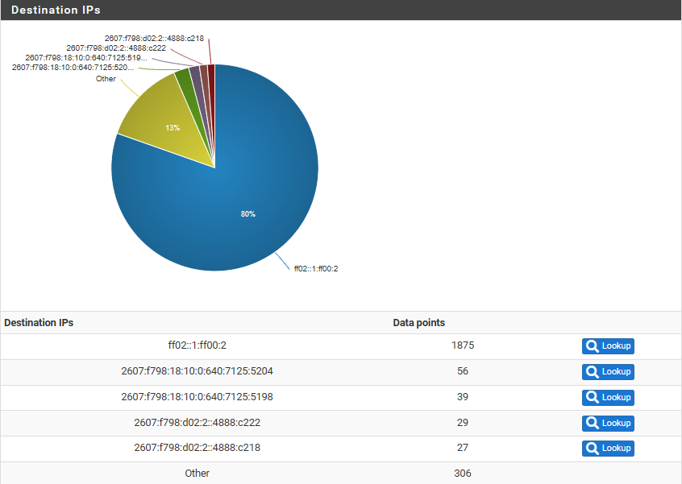

# Home Lab Network Security Project

## Overview
This project demonstrates the deployment and configuration of a controlled home lab environment designed to evaluate firewall behavior, network traffic monitoring, and service exposure analysis. The lab includes internal client systems, a firewall appliance, and target hosts to simulate real-world network segmentation and inspection scenarios.

All testing was performed in a contained environment with explicit focus on internal network traffic and service discovery.

---

## Key Technical Focus Areas

### Stateful Firewall Operations
The firewall was configured as a **stateful Layer 3 gateway**, enforcing rules for inter-host communication with full session tracking.

- Maintains **state table entries** for TCP, UDP, and ICMP traffic.
- Differentiates **new connections** from **established sessions**.
- Applies rules based on **interface, direction, protocol, and port**.
- Logs traffic according to **pass, block, or drop events**.

Stateful behavior was validated against observed client-host interactions.

---

### Traffic Visibility & Logging
Firewall logs captured both **allowed and denied traffic**, providing detailed visibility into network behavior:

- **ICMP echo requests/replies** for reachability testing.
- **TCP SYN attempts** for port scanning/service discovery.
- **DNS queries (UDP/53)** from client systems and background services.

Logs provided insight into **source/destination relationships, protocols, and port usage**, helping to distinguish normal traffic from reconnaissance activity.

**Screenshots:**  

---

### Service Enumeration & Exposure Analysis
Controlled service discovery from the client to target hosts evaluated network exposure:

- Host discovery via ICMP.
- Multi-port scanning to detect open services.
- Service/version detection to analyze responses through the firewall.

Firewall logs captured connection attempts to key service ports, including:

- **445 (SMB)**
- **3389 (RDP)**
- **135 (RPC)**
- **139 (NetBIOS)**
- **80/443 (HTTP/HTTPS)**

Scan results were cross-referenced with firewall logs to understand **open, closed, and filtered states**.

**Screenshots:**  
`HomeLabScreenshots/ipa.png`  

---

### Policy Enforcement & Traffic Control
Custom rules were implemented to control service access between internal hosts:

- Tested **rule order precedence** and top-down processing.
- Evaluated **protocol-specific filtering** (e.g., ICMP allowed, SMB blocked).
- Measured impact of restricting high-risk ports on service visibility.

Scan behavior confirmed **active enforcement of network policies**.

**Screenshots:**  
`HomeLabScreenshots/`  

---

### Bidirectional Traffic Monitoring
The firewall was positioned to inspect **all internal traffic**, enabling monitoring of:

- Client-initiated connections.
- Server responses.
- Lateral communication attempts.

This setup reinforces **internal segmentation and inspection** for enhanced security.

**Screenshots:**  
`HomeLabScreenshots/traffic_monitoring.png`  

---

### Log-Driven Network Analysis
Logs were treated as a primary source for analysis:

- Identifying patterns of service discovery.
- Differentiating benign activity from broad scanning behavior.
- Verifying the effect of firewall rule changes on traffic flow.

This mimics **SOC workflows** for log correlation and security validation.

**Screenshots:**  
`HomeLabScreenshots/log_analysis.png`  

---

## Screenshots
All screenshots from testing and configuration can be found in the `HomeLabScreenshots` folder.

---

## Notes
This lab was conducted in a controlled environment for educational purposes. All configurations and tests were performed on isolated systems with no external network exposure.
